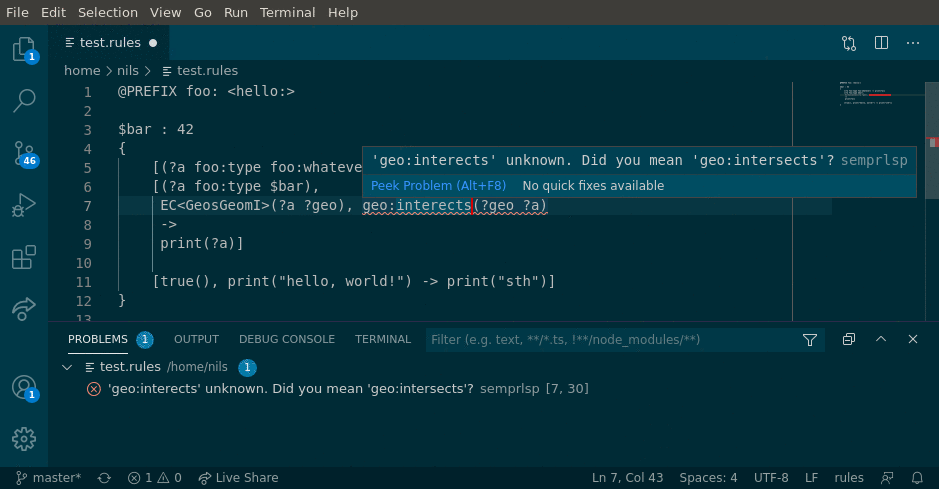

# What is sempr-lsp?

sempr-lsp is a utility tool which can be used to parse text files and report
diagnostic information. It uses the "language server protocol" which makes it
usable in many different editors (vscode, vim, atom, ...).

> **Note:** This package does not provide syntax highlighting.





## Prerequisites

```
- pygls for the language server:
    pip install pygls

- pybind11 to create python bindings to the c++ code
    pip install pybind11

- a recent version of sempr and rete

```

## Compile

```
cd lib
mkdir build
cd build
pybind11_DIR=<path to site-pakages/pybind11/share/cmake/pybind11> cmake ..
make -j8
```

This created a custom python module, called something like 
`semprlsp.cpython-36m-x86_64-linux-gnu.so`.

## Usage

The actual language server is `server.py`. When started, it listens on port 8066.
Make sure the previously compiled python module can be found, e.g. by
specifying it on the `PYTHONPATH`:

```
# run from the build folder
PYTHONPATH=. ../../server.py
```

### Connecting to an editor

Many editors support custom language servers that support the language server
protocol (lsp).

#### VIM + YCM


`.vimrc:`
```vim
" enable custom language server for ycmd
let g:ycm_language_server =
            \ [
            \   {
            \       'name' : 'rules',
            \       'port' : '8066',
            \       'filetypes' : ['rules'],
            \   },
            \ ]
```

Note: The connection via TCP is preferred during development -- it makes
debugging a bit easier for me. But ycm stops the language server when it is
no longer needed, and can't restart it like this. This can be changed by
providing a `'cmdline' : '<call to start server.py>'` entry.

To automatically set the filetype to `rules`:

`.vim/filetype.vim`
```
" custom filetypes
if exists("did_load_filetypes")
    finish
endif

augroup filetypedetect
    au! BufRead,BufNewFile *.rules      setfiletype rules
augroup END
```

